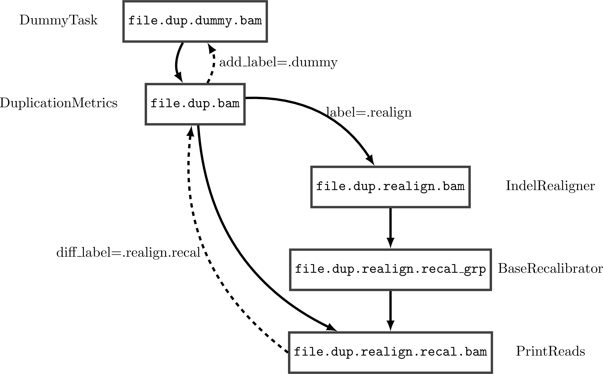

Ratatosk configuration
=======================

Configuration parser
--------------------

ratatosk uses a yaml config parser that enforces section and
subsections, treating everything below that level as
lists/dicts/variables. An example is shown here:

.. code-block:: text

   section:
     subsection:
       options:
         - option1
	 - option2

The parser maps everything below 'options' to regular python objects
(list in this case). An option is retrieved via the function
:py:meth:`.RatatoskConfigParser.get`

The reason for this is best explained by looking at the tasks.
Remember that every task by default has a :attr:`_config_section
<ratatosk.job.BaseJobTask._config_section>` and a
:attr:`_config_subsection
<ratatosk.job.BaseJobTask._config_subsection>` attribute. These
attributes are mapped to the section and subsection levels. For
instance, :class:`ratatosk.lib.align.bwa.Aln` has ``_config_section
= "bwa"`` and ``_config_subsection = "Aln"`` . Therefore, the
following configuration section

.. code-block:: text

   bwa:
     Aln:
       options:
	 - -e 2
	 - -l 40

will run the command ``bwa aln -e 2 -l 40 ...``.

Working with parent tasks
-------------------------

All tasks have a default requirement, which I call ``parent_task``. In
the current implementation, all tasks subclass :class:`.BaseJobTask`,
which provides a ``parent_task`` class variable. This variable can be
changed, either at the command line (option ``--parent-task``) or in a
configuration file. The ``parent_task`` variable is a string
representing a class in a python module, and could therefore be any
python code of choice. In addition to the ``parent_task`` variable,
:class:`.BaseJobTask` provides variables :attr:`_config_section
<ratatosk.job.BaseJobTask._config_section>` and
:attr:`_config_subsection
<ratatosk.job.BaseJobTask._config_subsection>` that point to sections
and subsections in the config file, which should be in yaml format
(see `google app
<https://developers.google.com/appengine/docs/python/config/appconfig>`_
for nicely structured config files). By default, all ``metrics``
functions have as parent class
:class:`ratatosk.lib.tools.picard.InputBamFile`. This can easily be
modified in the config file to:

.. code-block:: text

    picard:
      InputBamFile:
        parent_task: ratatosk.lib.tools.samtools.SamToBam
      HsMetrics:
        parent_task: ratatosk.lib.tools.picard.SortSam
        targets: targets.interval_list
        baits: targets.interval_list
      DuplicationMetrics:
        parent_task: ratatosk.lib.tools.picard.SortSam
      AlignmentMetrics:
        parent_task: ratatosk.lib.tools.picard.SortSam
      InsertMetrics:
        parent_task: ratatosk.lib.tools.picard.SortSam
    
    samtools:
      SamToBam:
        parent_task: ratatosk.lib.align.BwaSampe

Note also that :class:`ratatosk.lib.tools.picard.InputBamFile` has
been changed to depend on
:class:`ratatosk.lib.tools.samtools.SamToBam` (default value is
:class:`ratatosk.lib.files.external.BamFile`).

Resolving dependencies
----------------------

The previous examples have assumed that tasks have one parent task.
However, many applications depend on more than one input (Figure 1).

.. figure:: ../../grf/dupmetrics_to_printreads.png
   :alt: dupmetrics_to_printreads
   :scale: 50%
   :align: center

   **Figure 1.** Excerpt from variant calling pipeline

Therefore, the ``parent_task`` variable can also be a list of tasks.
For instance, in Figure 1, the dependencies for :class:`.PrintReads`
would be defined by the following configuration:

.. code-block:: text

   gatk:
     PrintReads:
       parent_task:
	 - ratatosk.lib.tools.gatk.DuplicationMetrics
	 - ratatosk.lib.tools.gatk.BaseRecalibrator
	 - ratatosk.lib.tools.gatk.PicardMetrics

The order is important here. For gatk tasks, the first argument should
be a bam/sam file. Since :class:`.PrintReads` also requires output from
:class:`.BaseRecalibrator`, the second parent task is
:class:`ratatosk.lib.tools.gatk.BaseRecalibrator`. These are also the
default parent tasks. In addition, the task
:class:`.PicardMetrics` has been set as a parent
task. Whenever you add more dependencies than defaults, ratatosk will
try to load the additional parent, and if that fails, fall back on
:class:`ratatosk.job.NullJobTask`, a task that always succeeds. 

.. note:: Setting additional parent tasks only work if 1) it is a
   wrapper task that generates its targets only from it's own parents
   or 2) it uses the same target as the first default task

Generating source names
-----------------------

.. warning:: The current implementation is confusing and will have to
   be reimplemented. See :ref:`issue_source_name_generation`.

Every class has a :meth:`requires <ratatosk.job.BaseJobTask.requires>`
method that returns a list of parent tasks on which the current task
depends. :mod:`ratatosk` dynamically loads the classes based on the
names in ``parent_task`` and generates the required target names *for
the parent task* in the method :meth:`_make_source_file_name
<ratatosk.job.BaseJobTask._make_source_file_name>`.

The procedure is best explained with an example. Consider figure 2,
which is a simplified representation of figure 1, but with target file
names in the boxes.

   **Figure 2.** Excerpt from variant calling pipeline with target
   names. A dummy task has been added to illustrate a case where a
   parent has a label that should be removed from the child target
   name (e.g. for read suffixes in paired-end reads).

First, many tasks add *labels* to their output. Hence, every task has
an attribute :attr:`label <ratatosk.job.BaseJobTask.label>`. When the
source file name is generated, the parent label is removed from the
current task target name (example ``file.dup.realign.bam`` ->
``file.dup.bam``. Second, in cases where there is a dependency on an
ancestor task (DuplicationMetrics above), several labels should be
removed. This is currently done with the attribute :attr:`diff_label
<ratatosk.job.BaseJobTask.diff_label>`. Finally, some labels should be
removed from parent to child - or added going "upwards". Hence, the
attribute :attr:`add_label <ratatosk.job.BaseJobTask.add_label>`.

Confusing? Yes.
