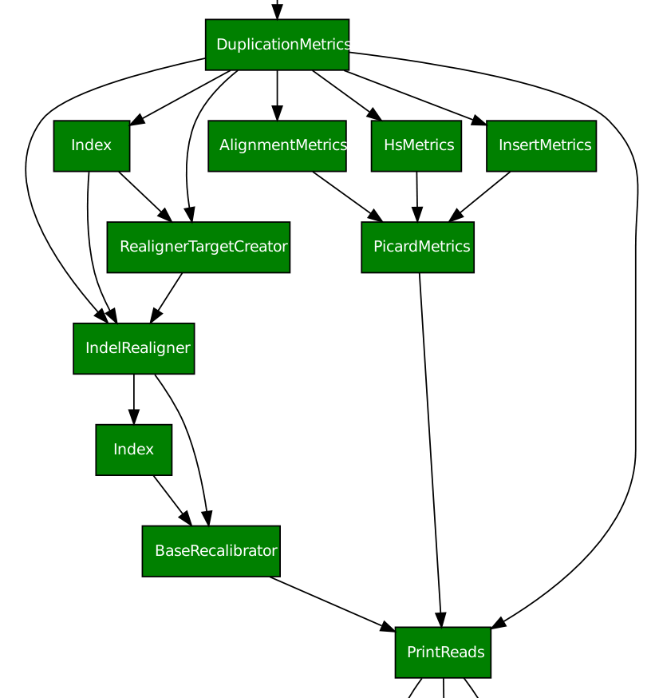

Ratatosk configuration
=======================

Configuration parser
--------------------

*ratatosk* uses a yaml config parser that enforces section and
subsections, treating everything below that level as
lists/dicts/variables. An example is shown here:

.. code:: yaml

   section:
     subsection:
       options:
         - option1
	 - option2

The parser maps everything below 'options' to regular python objects
(list in this case). An option is retrieved via the function
`config_obj.get(section=section, subsection=subsection,
option=options)`.

The reason for this is best explained by looking at the tasks.
Remember that every task by default has a *_config_section* and a
*_config_subsection* attribute. These attributes are mapped to the
section and subsection levels. For instance,
`ratatosk.lib.align.bwa.Aln` has ```_config_section = "bwa"``` and
```_config_subsection = "Aln"```. Therefore, the following
configuration section

.. code:: yaml

   bwa:
     Aln:
       options:
	 - -e 2
	 - -l 40

will run the command ```bwa aln -e 2 -l 40 ...```.


Working with parent tasks
-------------------------

All tasks have a default requirement, which I call `parent_task`. In
the current implementation, all tasks subclass `ratatosk.job.JobTask`,
which provides a `parent_task` class variable. This variable can be
changed, either at the command line (option `--parent-task`) or in a
configuration file. The `parent_task` variable is a string
representing a class in a python module, and could therefore be any
python code of choice. In addition to the `parent_task` variable,
`JobTask` provides variables `_config_section` and
`_config_subsection` that point to sections and subsections in the
config file, which should be in yaml format (see
`google app` <https://developers.google.com/appengine/docs/python/config/appconfig>`_
for nicely structured config files). By default, all `metrics`
functions have as parent class
`ratatosk.lib.tools.picard.InputBamFile`. This can easily be modified
in the config file to:

.. code:: yaml

    picard:
      InputBamFile:
        parent_task: ratatosk.lib.tools.samtools.SamToBam
      HsMetrics:
        parent_task: ratatosk.lib.tools.picard.SortSam
        targets: targets.interval_list
        baits: targets.interval_list
      DuplicationMetrics:
        parent_task: ratatosk.lib.tools.picard.SortSam
      AlignmentMetrics:
        parent_task: ratatosk.lib.tools.picard.SortSam
      InsertMetrics:
        parent_task: ratatosk.lib.tools.picard.SortSam
    
    samtools:
      SamToBam:
        parent_task: ratatosk.lib.align.BwaSampe


Note also that `InputBamFile` has been changed to depend on
`ratatosk.lib.tools.samtools.SamToBam` (default value is
`ratatosk.lib.files.external.BamFile`). 

Resolving dependencies
======================


   
   **Figure 1.** Excerpt from variant calling pipeline
