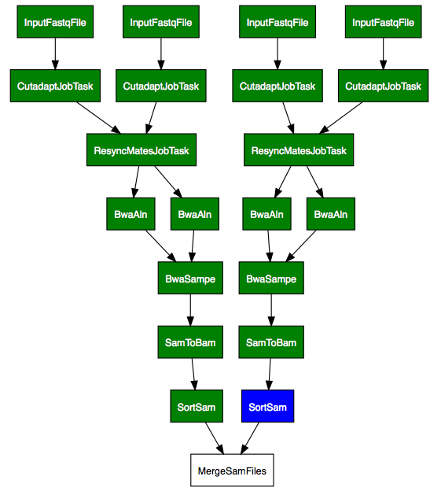
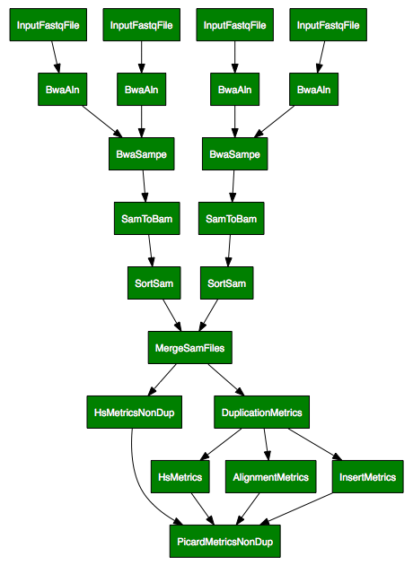

Examples
========

.. note:: This section contains examples that are sligtly outdated.
   They were initially used as examples at the github site and are
   kept here for reference.

Examples in tests
-----------------

These examples are currently based on the tests in
:py:mod:`ratatosk.tests.test_commands` and
:py:mod:`ratatosk.tests.test_wrappers`.

Creating file links
^^^^^^^^^^^^^^^^^^^^^^^^

The task :py:class:`ratatosk.lib.files.fastq.FastqFileLink` creates a
link from source to a target. The source in this case depends on an
*external* task (:py:class:`ratatosk.lib.files.external.FastqFile`
meaning this file was created by some outside process (e.g. sequencing
machine).

.. code-block:: text

	nosetests -v -s test_wrapper.py:TestMiscWrappers.test_fastqln

.. figure:: ../../grf/test_fastqln.png
   :alt: Fastq link task
   :scale: 30%
   :align: center

   **Figure 1.** Fastq link task

A couple of comments are warranted. First, the boxes shows tasks,
where the :py:class:`.FastqFile` is an external task. The file it
points to must exist for the task :py:class:`.FastqFileLink` executes.
The color of the box indicates status; here, green means the task has
completed successfully. Second, every task has its own set of options
that can be passed via the command line or in the code. In the
:py:class:`.FastqFileLink` task box we can see the options that were
passed to the task. For instance, the option ``use_long_names=True``
prints complete task names, as shown above.
	
Alignment with bwa sampe
^^^^^^^^^^^^^^^^^^^^^^^^^^^^

Here's a more useful example; paired-end alignment using
:program:`bwa`.

.. code-block:: text

	nosetests -v -s test_commands.py:TestCommand.test_bwasampe

.. figure:: ../../grf/test_bwasampe.png
   :alt: bwa sampe
   :scale: 50%
   :align: center

   **Figure 2.** Read alignment with bwa.

	
Wrapping up metrics tasks
^^^^^^^^^^^^^^^^^^^^^^^^^

The class :py:class:`ratatosk.lib.tools.picard.PicardMetrics`
subclasses :py:class:`ratatosk.job.JobWrapperTask` that can be used to
require that several tasks have completed. Here I've used it to group
picard metrics tasks:

.. code-block:: text

	nosetests -v -s test_commands.py:TestCommand.test_picard_metrics

.. figure:: ../../grf/test_picard_metrics.png
   :alt: picard metrics
   :scale: 50%
   :align: center

   **Figure 3.** Summarizing metrics with a wrapper task

Here, I've set the option ``--use-long-names=False``, which changes
the output to show only the class names for each task. This example
utilizes a configuration file that links tasks together. More about
that in the next example.

Examples with :program:`ratatosk_run.py`
------------------------------------------------

NB: these examples don't actually do anything except plot the
dependencies. To actually run the pipelines, see the examples in the
extension module :mod:`ratatosk.ext.scilife`.

Dry run
^^^^^^^

The ``--dry-run`` option will resolve dependencies but not actually
run anything. In addition, it will print the tasks that will be
called. By passing a target

.. code-block:: text

	ratatosk_run.py RawIndelRealigner --target sample.merge.realign.bam 
		--custom-config /path/to/ratatosk/examples/J.Doe_00_01.yaml --dry-run

we get the dependencies as specified in the config file:

.. figure:: ../../grf/ratatosk_dry_run.png
   :alt: dry run
   :scale: 50%
   :align: center

   **Figure 1.** Dry run output.

The task :class:`RawIndelRealigner
<ratatosk.pipeline.haloplex.RawIndelRealigner>` is defined in
:mod:`ratatosk.pipeline.haloplex` and is a modified version of
:class:`IndelRealigner <ratatosk.lib.tools.gatk.IndelRealigner>`. It
is used for analysis of HaloPlex data.

Merging samples over several runs
^^^^^^^^^^^^^^^^^^^^^^^^^^^^^^^^^^^^^^^^

Samples that have data from two separate runs should be merged. The
class :class:`ratatosk.lib.tools.picard.MergeSamFiles` merges
sample_run files and places the result in the sample directory. The
:class:`.MergeSamFiles` task needs information on how to find files to
merge. This is currently done by registering a handler via the
configuration option :attr:`target_generator_handler
<ratatosk.lib.tools.picard.MergeSamFiles.target_generator_handler>`.
In the custom configuration file ``J.Doe_00_01.yaml``, we have

.. code-block:: text

    ratatosk.lib.tools.picard:
      MergeSamFiles:
        parent_task: ratatosk.lib.tools.picard.SortSam
        target_generator_handler: test.site_functions.collect_sample_runs

where the function :func:`test.site_functions.collect_sample_runs` is
defined as

.. code-block:: python

   def collect_sample_runs(task):
       return ["sample/fc1/sample.sort.bam",
	       "sample/fc2/sample.sort.bam"]

This can be any python function, with the only requirement that it
return a list of source file names. This task could be run as follows

.. code-block:: text

	ratatosk_run.py MergeSamFiles  --target sample.sort.merge.bam
	  --config-file /path/to/ratatosk/examples/J.Doe_00_01.yaml

resulting in (dry run version shown here)

.. figure:: ../../grf/example_align_seqcap_merge.png
   :alt: dry run
   :scale: 50%
   :align: center

   **Figure 2.** Dry run output of merging.

Adding adapter trimming
^^^^^^^^^^^^^^^^^^^^^^^

Changing the following configuration section (see ``J.Doe_00_01_trim.yaml``):

.. code-block:: text

	ratatosk.lib.utils.misc:
	  ResyncMates:
	    parent_task: ratatosk.lib.utils.cutadapt.CutadaptJobTask

	ratatosk.lib.align.bwa:
	  Aln:
	    parent_task: ratatosk.lib.utils.misc.ResyncMatesJobTask

and running 

.. code-block:: text

	ratatosk_run.py MergeSamFiles  
		--target P001_101_index3/P001_101_index3.trimmed.sync.sort.merge.bam 
		--config-file ~/opt/ratatosk/examples/J.Doe_00_01_trim.yaml

	
runs the same pipeline as before, but on adapter-trimmed data.

   **Figure 3.** Adding adapter trimming

Extending workflows with subclassed tasks
^^^^^^^^^^^^^^^^^^^^^^^^^^^^^^^^^^^^^^^^^

It's dead simple to add tasks of a given type. Say you want to
calculate hybrid selection on bam files that have and haven't been
mark duplicated. By subclassing an existing task and giving the new
class it's own configuration file location, you can configure the new
task to depend on whatever you want. In
:mod:`ratatosk.lib.tools.picard` I have added the following class:

.. code-block:: python

   class HsMetricsNonDup(HsMetrics):
	   """Run on non-deduplicated data"""
	   parent_task = luigi.Parameter(default="ratatosk.lib.tools.picard.MergeSamFiles")

and a picard metrics wrapper task

.. code-block:: python

   class PicardMetricsNonDup(JobWrapperTask):
       """Runs hs metrics on both duplicated and de-duplicated data"""
       def requires(self):
	   return [InsertMetrics(target=self.target + str(InsertMetrics.target_suffix.default[0])),
		   HsMetrics(target=self.target + str(HsMetrics.target_suffix.default)),
		   HsMetricsNonDup(target=rreplace(self.target, str(DuplicationMetrics.label.default), "", 1) + str(HsMetrics.target_suffix.default)),
		   AlignmentMetrics(target=self.target + str(AlignmentMetrics.target_suffix.default))]

The task can be configured by adding a configuration subsection
*PicardMetricsNonDup* to the :mod:`picard <ratatosk.lib.tools.picard>`
configuration section. In the configuration file
``J.Doe_00_01_nondup.yaml`` we have:

.. code-block:: text

   ratatosk.lib.tools.picard:
     PicardMetricsNonDup:
       parent_task: ratatosk.lib.tools.picard.DuplicationMetrics

Running 

.. code-block:: text

	ratatosk_run.py PicardMetricsNonDup  --target P001_101_index3/P001_101_index3.sort.merge.dup
	  --config-file ~/opt/ratatosk/examples/J.Doe_00_01_nondup.yaml
	
will add hybrid selection calculation on non-deduplicated bam file for sample ``P001_101_index3``:

   **Figure 4.** Adding custom tasks.
