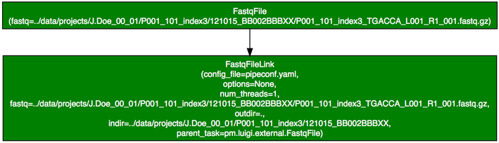
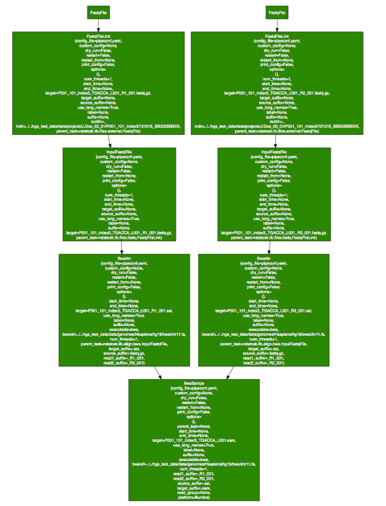
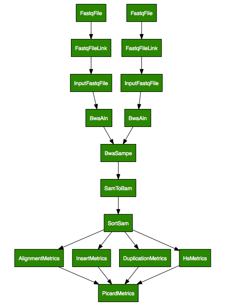

Installation
============

Pre-requisites
--------------

It is recommended that you first create a virtual environment in which
to install the packages. Install
`virtualenvwrapper <http://virtualenvwrapper.readthedocs.org/en/latest/>`_
and use
`mkvirtualenv <http://virtualenvwrapper.readthedocs.org/en/latest/command_ref.html>`_
to create a virtual environment.

.. _installation:
Installation
------------

To install the development version of `ratatosk`, do

.. code-block:: bash
	
	git clone https://github.com/percyfal/ratatosk
	python setup.py develop

Dependencies
------------

To begin with, you may need to install
`Tornado <http://www.tornadoweb.org/>`_ and
`Pygraphviz <http://networkx.lanl.gov/pygraphviz/>`_ (see
`Luigi <https://github.com/spotify/luigi/blob/master/README.md>`_ for
further information).

The tests depend on the following software to run:

1. `bwa <http://bio-bwa.sourceforge.net/>`_
2. `samtools <http://samtools.sourceforge.net/>`_
3. `GATK <http://www.broadinstitute.org/gatk/>`_ - set an environment
   variable `GATK_HOME` to point to your installation path
4. `picard <http://picard.sourceforge.net/>`_ - set an environment
   variable `PICARD_HOME` to point to your installation path
5. `fastqc <http://www.bioinformatics.babraham.ac.uk/projects/fastqc/>`_   

Running the tests
-----------------

Cd to the luigi test directory (`tests`) and run

.. code-block:: bash

	nosetests -v -s test_commands.py
	
To run a given task (e.g. TestCommand.test_bwaaln), do

.. code-block:: bash

	nosetests -v -s test_commands.py:TestCommand.test_bwaaln

Task visualization and tabulation
-------------------------------------

By default, the tests use a local scheduler, implemented in luigi. For
production purposes, there is also a `central planner
<https://github.com/spotify/luigi/blob/master/README.md#using-the-central-planner>`_.
Among other things, it allows for visualization of the task flow by
using `Tornado <http://www.tornadoweb.org/>`_ and
`Pygraphviz <http://networkx.lanl.gov/pygraphviz/>`_. Results are
displayed in *http://localhost:8081*, results "collected" at
*http://localhost:8082/api/graph*.

In addition, I have extended the luigi daemon and server code to
generate a table representation of the tasks (in
*http://localhost:8083*). The aim here would be to define a grouping
function that groups task lists according to a given feature (e.g.
sample, project).

In order to view tasks, run

.. code:: bash

	ratatoskd &
	
in the background and run the tests:

.. code:: bash

	nosetests -v -s test_commands.py
	

Examples in tests
-----------------

These examples are currently based on the tests in
`ratatosk.tests.test_commands` and `ratatosk.tests.test_wrappers`.

Creating file links
^^^^^^^^^^^^^^^^^^^^^^^^

The task :ref:`ratatosk.lib.files.fastq.FastqFileLink` creates a link
from source to a target. The source in this case depends on an
*external* task (:ref:`ratatosk.lib.files.external.FastqFile` meaning
this file was created by some outside process (e.g. sequencing
machine).

.. code:: bash

	nosetests -v -s test_wrapper.py:TestMiscWrappers.test_fastqln

   
   Fastq link task

A couple of comments are warranted. First, the boxes shows tasks,
where the `FastqFile` is an external task. The file it points to must
exist for the task `FastqFileLink` executes. The color of the box
indicates status; here, green means the task has completed
successfully. Second, every task has its own set of options that can
be passed via the command line or in the code. In the `FastqFileLink`
task box we can see the options that were passed to the task. For
instance, the option `use_long_names=True` prints complete task names,
as shown above. 
	
Alignment with bwa sampe
^^^^^^^^^^^^^^^^^^^^^^^^^^^^

Here's a more useful example; paired-end alignment using `bwa`.

.. code:: bash

	nosetests -v -s test_commands.py:TestCommand.test_bwasampe

	
Wrapping up metrics tasks
^^^^^^^^^^^^^^^^^^^^^^^^^

The class :ref:`ratatosk.lib.tools.picard.PicardMetrics` subclasses
:ref:`ratatosk.job.JobWrapperTask` that can be used to require that
several tasks have completed. Here I've used it to group picard
metrics tasks:

.. code:: bash

	nosetests -v -s test_commands.py:TestCommand.test_picard_metrics

Here, I've set the option `--use-long-names` to `False`, which changes
the output to show only the class names for each task. This example
utilizes a configuration file that links tasks together. More about
that in the next example.
