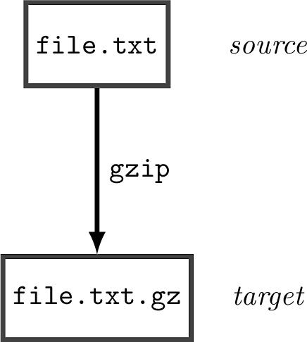
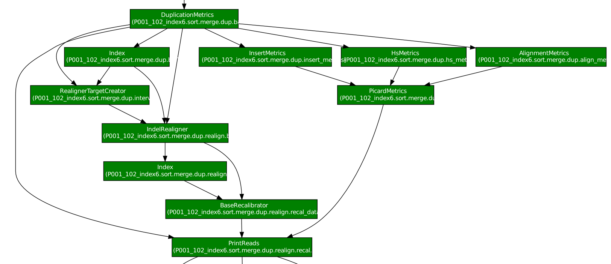
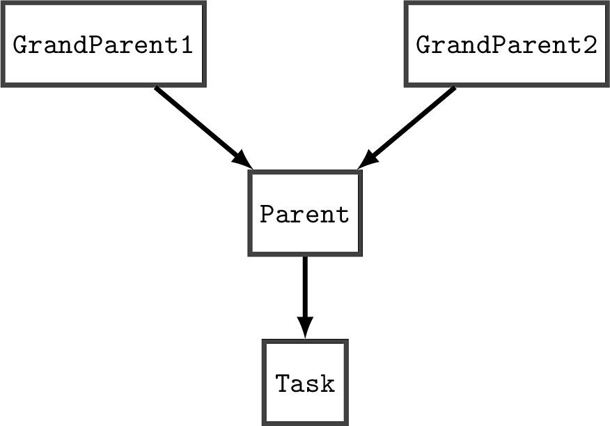

Introducing ratatosk
====================

:mod:`ratatosk` was initiated out of the need to write an analysis
pipeline for analysis of `HaloPlex
<http://www.genomics.agilent.com/GenericB.aspx?pagetype=Custom&subpagetype=Custom&pageid=3081>`_
data. At first, I ended up writing yet another unwieldy and
difficult-to-maintain `shell script
<https://github.com/SciLifeLab/scilifelab/blob/master/experimental/halo_pipeline.sh>`_,
running a couple of dozen steps. The script implements

1. checkpointing - if a step fails, rerunning the script will resume
   execution from that particular step
2. parallel execution - single-threaded jobs are grouped and piped via
   `GNU parallel <http://www.gnu.org/software/parallel/>`_. HaloPlex
   projects typically deal with many samples (50-100), so running them
   as node jobs is a waste of resources since many tasks are
   single-threaded. However, running samples as core jobs will fail
   since :program:`bwa sampe` requires 5.4 GB memory, whereas our
   8-core nodes have 24 GB memory. 

I was basically looking for a more modular approach to building
complex pipelines of batch jobs. A colleague pointed me to `luigi
<https://github.com/spotify/luigi>`_, which lets you do just that.
:mod:`ratatosk` is the (ever-changing) attempt to provide a
light-weight, simple, text-based system for defining and running
pipelines of batch jobs, adding a library of tasks that focus on
bioinformatics applications.

Of course, there are other workflow managers that provide much more
functionality (e.g. `Galaxy <https://main.g2.bx.psu.edu/>`_ , `Taverna
<http://www.taverna.org.uk/>`_, `Kepler
<https://kepler-project.org/>`_), but for various reasons, these
solutions are currently inaccessible at our HPC. Writing
:mod:`ratatosk` therefore is more of an experiment to try out some of
the attractive features of :mod:`luigi`, including:

1. script-based API
2. integrated hadoop support
3. near-atomic file operations (allowing checkpointing)
4. parallel execution via an internal scheduler

What is it?
----------------

Simply put, :mod:`ratatosk` is just a library of :mod:`luigi` tasks that
are implemented as wrappers for bioinformatics programs that primarily
are used for analysis of next-generation sequencing data. Therefore,
there is a one-to-one correspondence between a program (e.g.
:program:`bwa aln`) and a wrapper task (actually there are exceptions,
but I'll come to that later). However, any program could could be
wrapped up in a task, so the framework is by no means limited to
bioinformatics. For a complete list of wrapper modules, see section
:ref:`ratatosk.lib`.

In addition to providing a library of tasks, :mod:`ratatosk` adds a
framework for defining task dependencies via a simple configuration
file. The configuration file also allows for customizing program
options, output names, and more.

There is also a generic script, :program:`ratatosk_run.py`, that can
be used to call a specific task in the library:

.. code-block:: text

   ratatosk_run.py Task --config-file configuration.yaml

By configuring dependencies in the configuration file you are
configuring a workflow. In essence, this means you can create complex
workflows and modifying program options *without writing any code*
(well, at least very little :)). Code reuse at its best.

Of targets and make
-------------------

Central to task processing is the *target* concept. As the
:mod:`luigi` authors point out, :mod:`luigi` is conceptually similar to GNU
Make, so it's probably best to introduce the target concept by
recalling how :program:`make` does it. Let's assume you want to compress a
file, ``file.txt``, with :program:`gzip`. The command to run would then be
``gzip file.txt``, producing an output file ``file.txt.gz``,
illustrated below.

   
   **Figure 1.** Zipping files with gzip

With Make, you can define a rule

.. code-block:: text

   %.txt.gz: %.txt
         gzip $<

which when you run the command ``make file.txt.gz`` will look at the
make rules to see if there is a rule defined for files with suffix
``.txt.gz``, and if so, run the command defined for that rule. The
file ``file.txt.gz`` is commonly called the *target*, and ``file.txt``
the *source* (substituted by ``$<`` in the make command above). One
important thing to know is that if the target already exists, make
only runs a command if the source is newer than the target.

:mod:`ratatosk` revolves around the idea of a target, in that every
task accepts an option ``--target``. The task dynamically generates
the *source* file name, and :mod:`luigi` resolves the underlying
dependencies, running the task if the source file exists. :mod:`luigi`
does not, however, rerun a task should the target exist and the source
is newer than the target. This is important to keep in mind, as it
effects what tasks are run. The call to :program:`ratatosk_run.py`
would actually be

.. code-block:: text

   ratatosk_run.py Task --target target.out --config-file configuration.yaml

Basically, then, :mod:`ratatosk` is a collection of make targets, based on
a python framework.

Visualizing task dependencies
-----------------------------

One thing make doesn't do is visualize task dependencies (at least not
that I'm aware of). I chose to visualize the make tasks above in order
to connect to the way :mod:`luigi` visualizes tasks. :mod:`luigi` uses a
`central planner
<https://github.com/spotify/luigi#using-the-central-planner>`_ to
visualize the dependency graph. Below, I've shown an excerpt from one
of the implemented pipelines

   
   **Figure 2.** Excerpt from variant calling pipeline showing target dependencies.

Notice the similarities with Figure 1. Boxes contain file names, edges
are labelled with operations. Actually, this is a modified output
compared with :mod:`luigi`. The original output labels the boxes with
task names, as well as coloring them by status of a task (Figure 3).

.. figure:: ../../grf/dupmetrics_to_printreads.png
   :scale: 50%
   :align: center
   :alt: dupmetrics_to_printreads
   
   **Figure 3.** Excerpt from variant calling pipeline showing task dependencies and task statuses.

Configuration and resolution of task dependencies
-------------------------------------------------

:mod:`ratatosk` uses an internal configuration parser that parses yaml
files in which the top two hierarchies are interpreted as sections and
subsections:

.. code-block:: text

   # Main section level
   section:
     # Varibles can be set here
     ref: chr1.fa
     # Subsection level
     subsection:
       # Options level
       options:
         - -v
       parent_task:
         - lib.parent.task
       # Setting ref here overrides setting in sections
       ref: chr2.fa

The section/subsection organization effectively provides namespaces
for each task. The section level directly maps to *modules* that group
applications (e.g. :program:`GATK`), whereas subsections map to
*tasks* that in turn represent actual programs (e.g.
:program:`UnifiedGenotyper`). The subsequent level corresponds to
settings for the given task, such as program options. Consequently, it
is easy to customize the behaviour of every program in the config
file. Every key at the option level have defaults set for every task,
so in many cases it is unnecessary to modify these options.

In the example above, I've included the ``options`` key, which simply is
the list of options passed to the program executable. The key
``parent_task`` is conceptually more interesting as it defines the tasks
on which the current task depends. Consider figure 4.

   
   **Figure 4.** Resolving task dependencies

This dependency graph would be defined by the following configuration

.. code-block:: text

   # The section level names an existing python module
   ratatosk.module.name
     # Subsection level names a task in the ratatosk.module.name module
     Task:
       parent_task:
         - Parent
     Parent:
       parent_task:
         - GrandParent1
	 - GrandParent2

Note that since ``parent_task`` is a list, it is possible to define
dependencies on several parent tasks.

