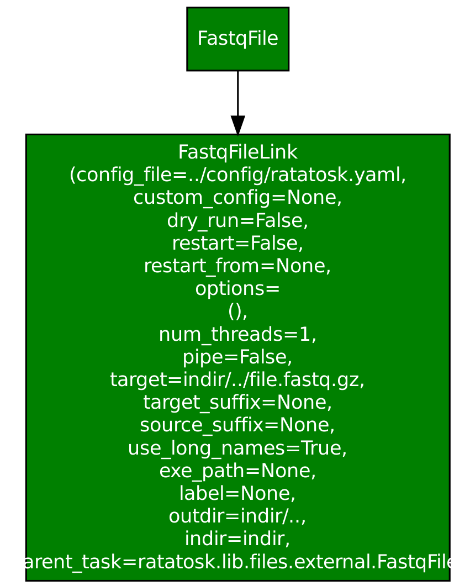
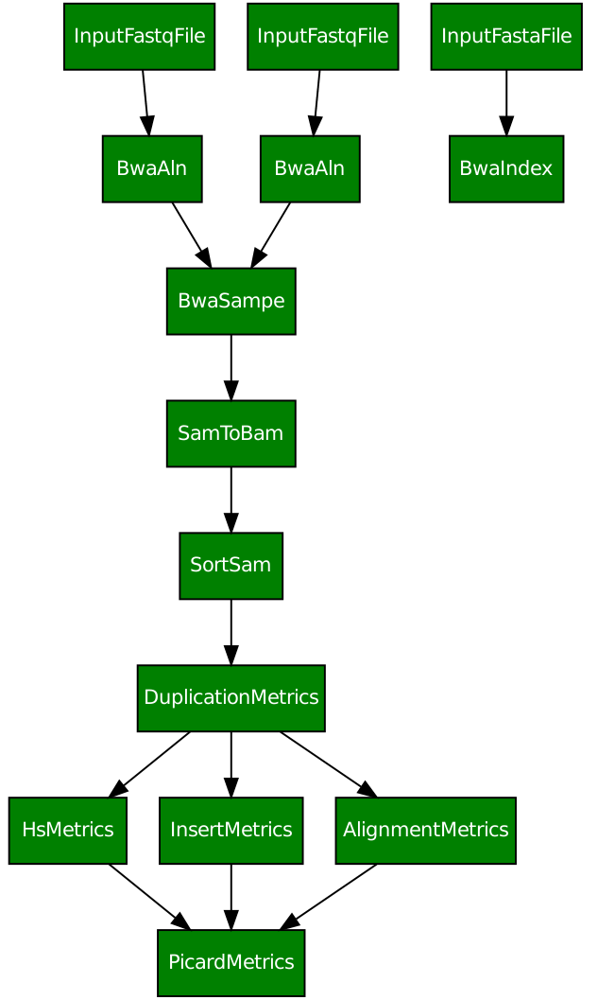

Quickstart
==========

Examples in tests
-----------------

These examples are currently based on the tests in
:py:mod:`ratatosk.tests.test_commands` and
:py:mod:`ratatosk.tests.test_wrappers`.

Creating file links
^^^^^^^^^^^^^^^^^^^^^^^^

The task :py:class:`ratatosk.lib.files.fastq.FastqFileLink` creates a
link from source to a target. The source in this case depends on an
*external* task (:py:class:`ratatosk.lib.files.external.FastqFile`
meaning this file was created by some outside process (e.g. sequencing
machine).

.. code-block:: text

	nosetests -v -s test_wrapper.py:TestMiscWrappers.test_fastqln

   **Figure 1.** Fastq link task

A couple of comments are warranted. First, the boxes shows tasks,
where the :py:class:`.FastqFile` is an external task. The file it
points to must exist for the task :py:class:`.FastqFileLink` executes.
The color of the box indicates status; here, green means the task has
completed successfully. Second, every task has its own set of options
that can be passed via the command line or in the code. In the
:py:class:`.FastqFileLink` task box we can see the options that were
passed to the task. For instance, the option ``use_long_names=True``
prints complete task names, as shown above.
	
Alignment with bwa sampe
^^^^^^^^^^^^^^^^^^^^^^^^^^^^

Here's a more useful example; paired-end alignment using
:program:`bwa`.

.. code-block:: text

	nosetests -v -s test_commands.py:TestCommand.test_bwasampe

.. figure:: ../../grf/test_bwasampe.png
   :alt: bwa sampe
   :scale: 50%
   :align: center

   **Figure 2.** Read alignment with bwa.

	
Wrapping up metrics tasks
^^^^^^^^^^^^^^^^^^^^^^^^^

The class :py:class:`ratatosk.lib.tools.picard.PicardMetrics`
subclasses :py:class:`ratatosk.job.JobWrapperTask` that can be used to
require that several tasks have completed. Here I've used it to group
picard metrics tasks:

.. code-block:: text

	nosetests -v -s test_commands.py:TestCommand.test_picard_metrics

   **Figure 3.** Summarizing metrics with a wrapper task

Here, I've set the option ``--use-long-names=False``, which changes
the output to show only the class names for each task. This example
utilizes a configuration file that links tasks together. More about
that in the next example.
