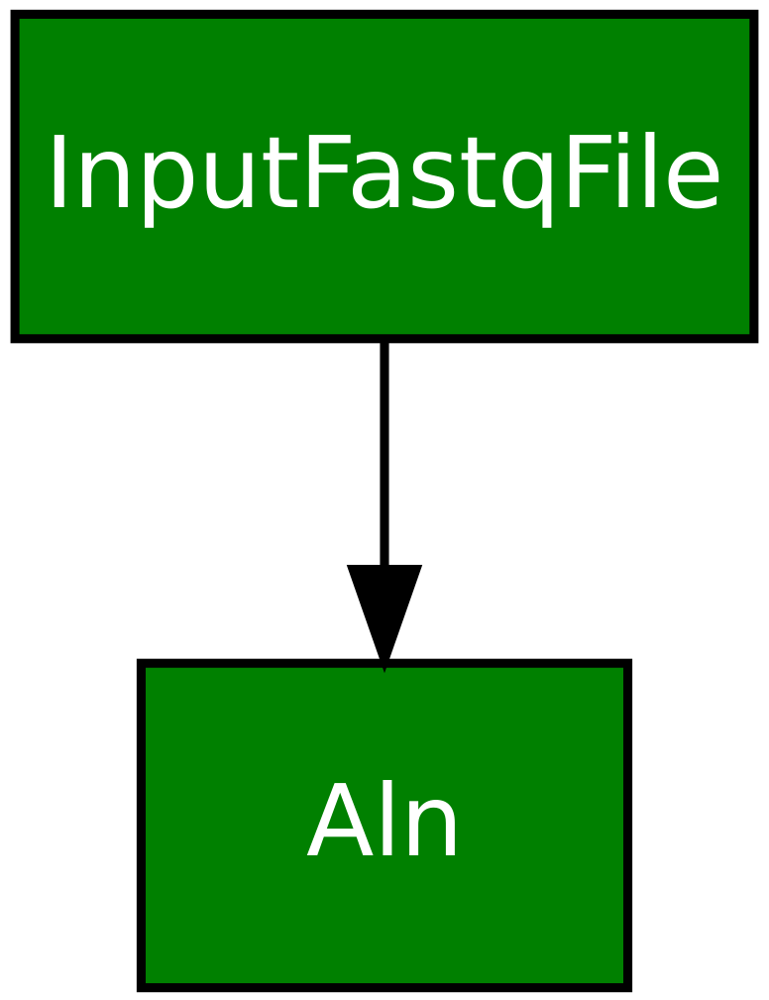
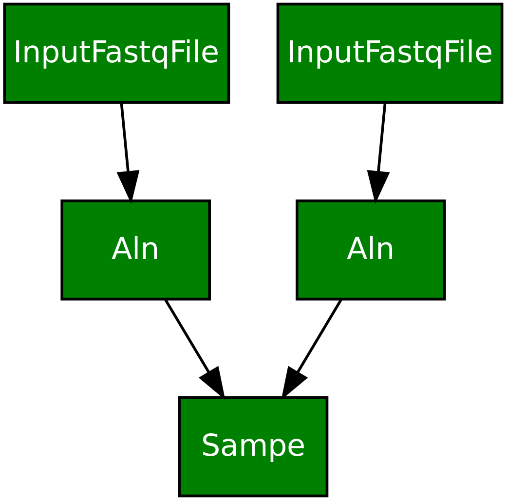

Writing a pipeline
==================

One of the main uses of :mod:`ratatosk` is to write an analysis pipeline.
The steps involved are best explained by following an example.

Example: a variant calling pipeline
-----------------------------------

Assume we want to define a pipeline that performs the following tasks:

1. align reads to a reference with :program:`bwa`
2. merge reads from several runs
3. generate summary statistics

Furthermore, assume we have the following input files (you'll actually
find these files in the test directory):

.. code-block:: text

   sample1_run1_1.fastq.gz
   sample1_run1_2.fastq.gz
   sample1_run2_1.fastq.gz
   sample1_run2_2.fastq.gz

Setting up dependencies between tasks requires two things:

1. setting the correct ``parent_task``
2. keeping track of the output file name (i.e. the target)

Furthermore, I'll assume we use a configuration file called
``config.yaml`` that we put in the ``test`` directory, running the
command from the :mod:`ratatosk` install directory.

1. Setting up alignment dependency
^^^^^^^^^^^^^^^^^^^^^^^^^^^^^^^^^^

.. note:: Currently you need to manually ``bwa index`` the reference.

Here we utilize the :class:`bwa.Aln <ratatosk.lib.align.bwa>` class.
The default ``parent_task`` is
:class:`ratatosk.lib.align.bwa.InputFastqFile`, which is defined to
point to a task without requirements (i.e. it was generated by some
external process). Therefore, for the parent task, we actually don't
need to add anything to our config file, but just for the sake of
clarity, we set the following in our config file. We do, however, need
to modify the ``bwaref`` that points to the reference (also located in
the test directory).

.. code-block:: text

   bwa:
     bwaref: test/data/chr11.fa
     Aln:
       parent_task: 
         - ratatosk.lib.align.bwa.InputFastqFile

Running the command ``ratatosk_run.py Aln --config-file
test/config.yaml --target test/data/sample1_run1_1.sai`` will run
``bwa aln -t 1 test/data/chr11.fa test/data/sample1_run1_1.fastq.gz \>
test/data/sample1_run1_1.sai-luigi-tmp-7165456595``, where the
temporary output file is renamed on success to the target file name,
which should be ``sample1_run1_1.sai`` .See figure 1 for the
corresponding graph.

   **Figure 1.** Alignment.

2. Setting up sampe dependency
^^^^^^^^^^^^^^^^^^^^^^^^^^^^^^^^^^

Next, we should run ``bwa sampe`` on the ``.sai`` files, generating an
output target ``sample1_run1.sam``. Here, we would need to strip out
the read suffixes (``_1`` and ``_2``). The latter are defined in the
``ratatosk.lib.align.bwa.Aln`` task by the options ``read1_suffix``
and ``read2_suffix``.

.. code-block:: text

   bwa:
     bwaref: test/data/chr11.fa
     Aln:
       parent_task: 
	 - ratatosk.lib.align.bwa.InputFastqFile
       read1_suffix: _1
       read2_suffix: _2
     Sampe:
       add_label: 
         - _1
         - _2

   **Figure 2.** Sampe.

Limitations of the current implementation
-----------------------------------------

It wouldn't be fair to not comment on some of the limitations and
problems with the current implementation.

1. There is no validation of task dependencies, and there probably
   never will due to lack of production time. This means you can
   connect any tasks, regardless of whether the output from the parent
   task can actually be used by a task. Sorting these dependencies out
   is left to the end user.
2. It can be nefariously difficult to derive the required labels that
   will be used to generate source names. See issues.

