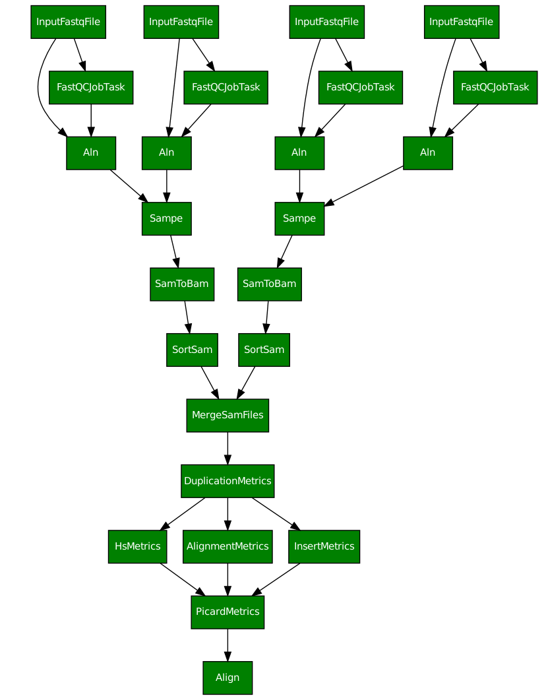

Basic alignment pipeline
========================

.. todo:: Add docs

   
   **Figure 1.** Alignment pipeline. The input consists of two read
   pairs from one sample, thus illustrating the merge operation at
   sample level.

