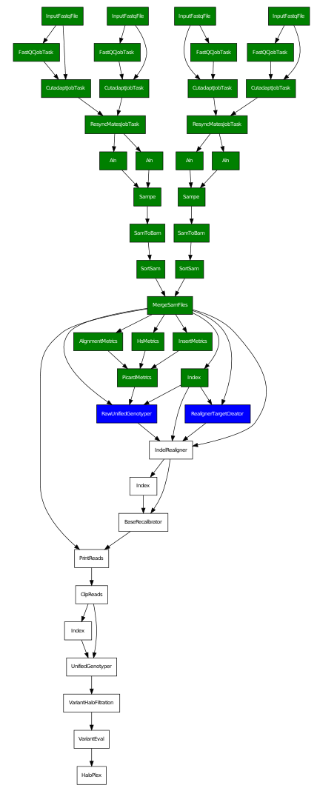

HaloPlex pipeline
=================

.. todo:: Add docs here

   
   **Figure 1.** HaloPlex pipeline

Blue boxes mean active processes (the command was run with `--workers
4`). Note that we need to know what labels are applied to the file
name (see issues). In this iteration, for the predefined pipelines the
file names have been hardcoded.
