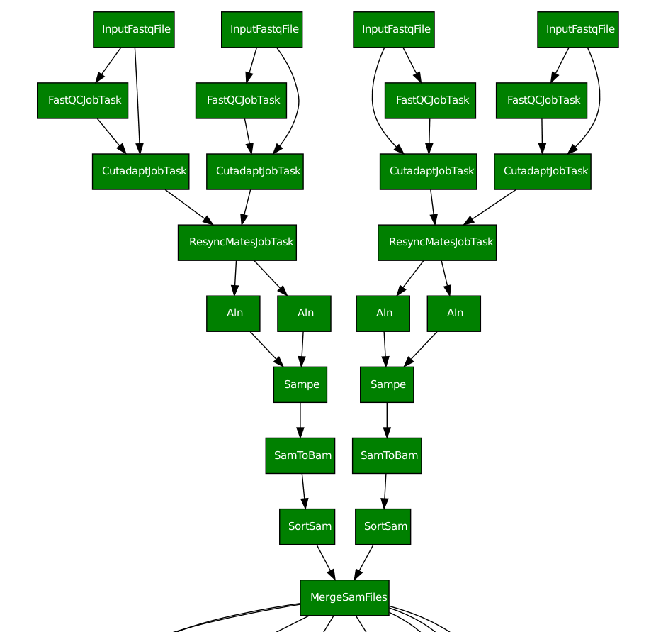
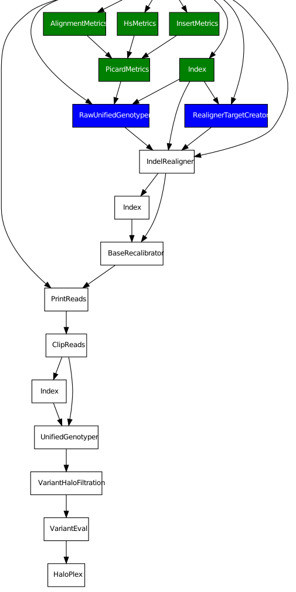
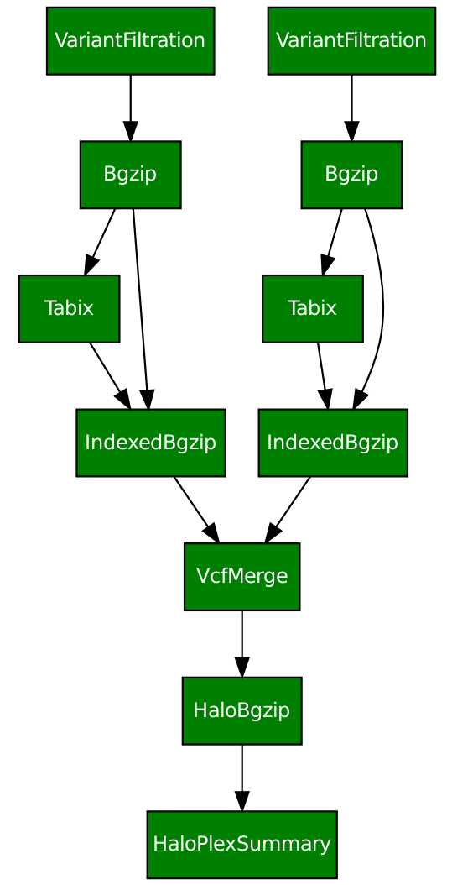
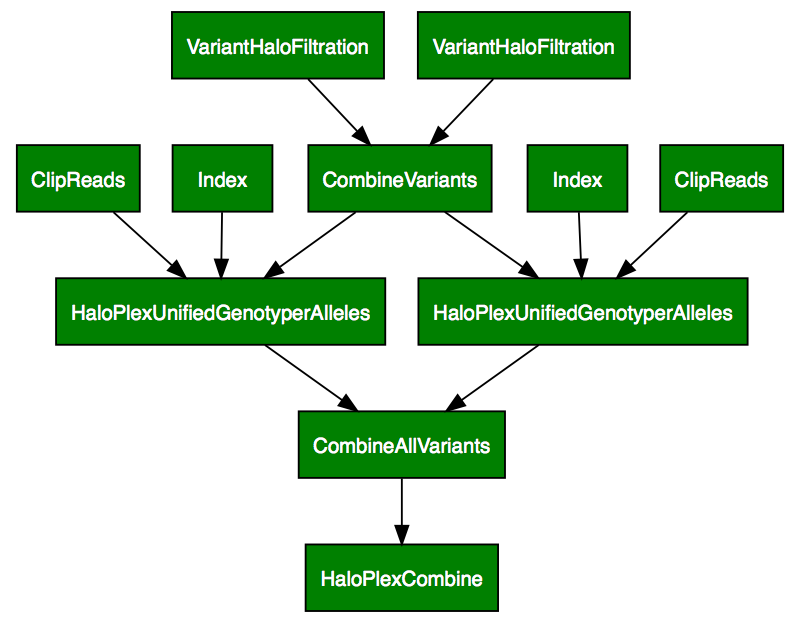

HaloPlex pipeline
=================

Variant calling
---------------

.. code-block:: text
   
   ratatosk_run.py HaloPlex --indir inputdir --custom-config custom_config_file.yaml

   
   **Figure 1.** HaloPlex pipeline, part 1. The input consists of two
   read pairs from one sample, thus illustrating the merge operation
   at sample level. The figure has been partitioned for clarity.

   
   **Figure 2.** HaloPlex pipeline, continued.

Blue boxes mean active processes (the command was run with ``--workers
4``). Note that we need to know what labels are applied to the file
name (see issues). In this iteration, for the predefined pipelines the
file names have been hardcoded.

Variant summary
---------------

.. code-block:: text

   ratatosk_run.py HaloPlexSummary --indir inputdir --custom-config custom_config_file.yaml

   
   **Figure 3.** HaloPlexSummary pipeline. Often there are so many
   samples that this step needs to be performed separately from the
   HaloPlex task.

Combining variants
------------------

The task :class:`HaloPlexCombine
<ratatosk.pipeline.haloplex.HaloPlexCombine>` combines variants from
samples, genotyping them at the 'union' of candidate positions
generated from sample-level variant calls.

.. code-block:: text

   ratatosk_run.py HaloPlexCombine --indir inputdir --custom-config custom_config_file.yaml

   
   **Figure 4.** HaloPlexCombine pipeline. Uses :program:`GATK
   CombineVariants` to combine sample vcf files to one output file. In
   the process, a master vcf is first generated, and all samples are
   *genotyped* given these alleles before combining to the final
   output.

