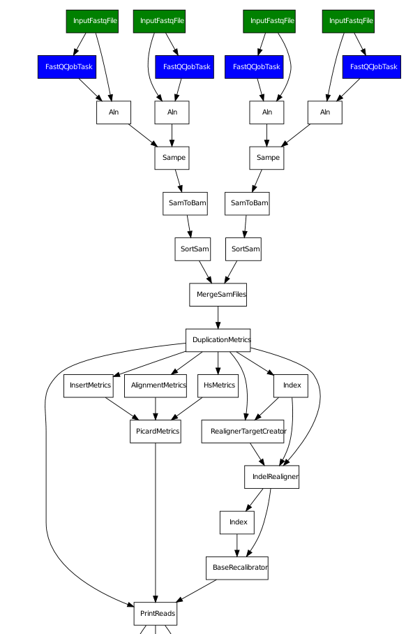
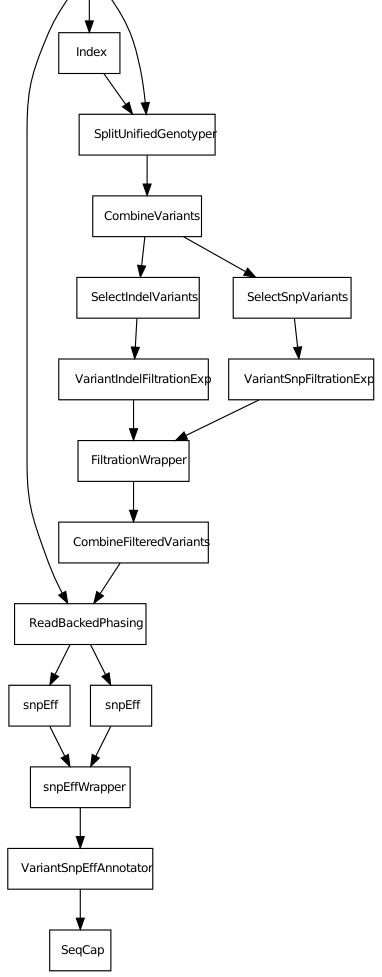

Sequence capture/resequencing pipeline
======================================

.. todo:: Add docs on pipeline

   
   **Figure 1.** Best practice variant calling pipeline, part 1. The
   input consists of two read pairs from one sample, thus illustrating
   the merge operation at sample level. The figure has been
   partitioned for clarity.

   
   **Figure 2.** Best practice variant calling pipeline, continued.

